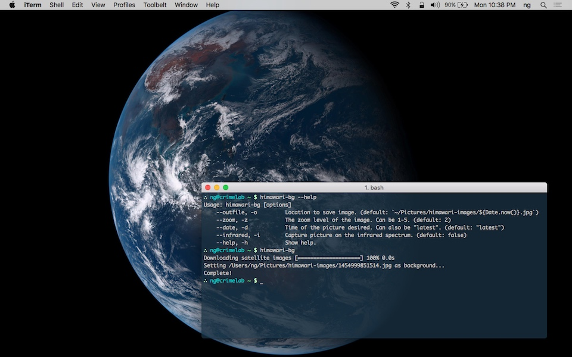

# himawari-bg

Set the latest image from Himawari 8 as your desktop background.

[![npm][npm-image]][npm-url]
[![build][build-image]][build-url]
[![downloads][downloads-image]][npm-url]

[npm-image]: https://img.shields.io/npm/v/himawari-bg.svg
[npm-url]: https://www.npmjs.com/package/himawari-bg
[build-image]: https://github.com/ungoldman/himawari-bg/actions/workflows/tests.yml/badge.svg
[build-url]: https://github.com/ungoldman/himawari-bg/actions/workflows/tests.yml
[downloads-image]: https://img.shields.io/npm/dm/himawari-bg.svg

## About

**[Himawari 8](http://himawari8.nict.go.jp/)** is a [geostationary](https://en.wikipedia.org/wiki/Geostationary_orbit) weather satellite deployed by the [Japan Meteorological Agency](http://www.jma.go.jp/jma/indexe.html). It takes photographs of Earth every 10 minutes.

**himawari-bg** is a command line program that lets you set the latest image from the Himawari 8 geostationary satellite as your desktop background.



## Install

Warning: requires :zap: **magick** :zap:

* [imagemagick](http://www.imagemagick.org/script/index.php)
* [graphicsmagick](http://www.graphicsmagick.org)
* [node.js](https://nodejs.org/en/download/)

If you have [homebrew](http://brew.sh/) installed, you can use that to quickly install `imagemagick` and `graphicsmagick`.

```
brew install imagemagick
brew install graphicsmagick
```

Once you have magick on your side, you can run himawari-bg anytime:

```
npx himawari-bg
```

## Usage

### Command Line

You can run `himawari-bg` on the command line with `npx` or via global install (`npm i -g himawari-bg`).

If you run `himawari-bg` with no arguments, it will download the latest image from Himawari-8 and set it as your desktop background.

:point_right: You have to set the background color of your desktop to black manually if you want it to look as cool as possible.

There are some options available if you'd like to go further:

```
Usage: himawari-bg [options]

    --outfile, -o         Location to save image. (default: ~/Pictures/himawari-images/$TIMESTAMP.jpg)
    --zoom, -z            The zoom level of the image. Can be 1-5. (default: 2)
    --date, -d            Time of the picture desired. Can also be "latest". (default: "latest")
    --infrared, -i        Capture picture on the infrared spectrum. (default: false)
    --parallel, -p        Parallelize downloads for increased speeds (can be CPU intensive). (default: true)
    --screen, -s          Screen to set the wallpaper on (macOS only). Options: "all", "main", screen index. (default: "main")
    --scale               Scaling method (macOS only). Options: "auto", "fill", "fit", "stretch", "center". (default: "fit")
    --version, -v         Show version information.
    --help, -h            Show help.
```

### Node.js

`himawari-bg` can also be used programmatically as a node module:

```
npm install himawari-bg
```

Here is an example of how it works in node:

```js
const himawariBG = require('himawari-bg')

himawariBG({
  /**
   * The location to save the resulting image.
   * Default: `~/Pictures/himawari-images/${Date.now()}.jpg`
   * @type {String}
   */
  outfile: '/path/to/output/earth.jpg',

  /**
   * The time of the picture desired. If you want to get the latest image, use 'latest'.
   * Default: 'latest'
   * @type {String|Date}
   */
  date: 'latest', // Or new Date() or a date string

  /**
   * The zoom level of the image. Can be 1-5 (default: 2)
   * Each zoom level requires more images to be downloaded and therefore stitched
   * together. Higher zoom yields a higher resolution image.
   * Default: 2
   * @type {Number}
   */
  zoom: 2,

  /**
   * If set to true, an image on the infrared light spectrum will be generated
   * Default: false
   * @type {Boolean}
   */
  infrared: false,

  /**
   * Screen to set the wallpaper on (macOS only)
   * Options: 'all', 'main', screen index
   * Default: 'main'
   * @type {String|Number}
   */
  screen: 'main',

  /**
   * Scaling method (macOS only)
   * Options: 'auto', 'fill', 'fit', 'stretch', 'center'
   * Default: 'fit'
   * @type {String|Number}
   */
  scale: 'fit'
})
```

All config settings are optional and have default values.

`himawariBG` returns a promise, so it can be used in an async workflow if needed.

```js
const himawariBG = require('himawari-bg')

async function () {
  try {
    await himawariBG()
  } catch (err) {
    console.log(err)
  }
}
```

## Acknowledgements

Thanks to [celoyd](https://github.com/celoyd) for the inspiring [`glittering.blue`](https://glittering.blue/) and [jakiestfu](https://github.com/jakiestfu) for creating [`himawari.js`](https://github.com/jakiestfu/himawari.js).

## Addendum

It turns out `himawari.js` was inspired by [this gist](https://gist.github.com/MichaelPote/92fa6e65eacf26219022) by [MichaelPote](https://github.com/MichaelPote) which basically does the exact same thing as `himawari-bg` except in a Windows Powershell environment. So I unwittingly made something inspired by something that was inspired by something that does what I did. Internet! `¯\_(ツ)_/¯`

## Additional Resources

Here are some useful links if you're interested in learning more about the Himawari 8 satellite.

### Official

- [Himawari 8 Real-time Web](http://himawari8.nict.go.jp)
- [Himawari Data Guide](http://www.eorc.jaxa.jp/ptree/userguide.html)
- [Himawari 8/9 Standard Data User's Guide](http://www.data.jma.go.jp/mscweb/en/himawari89/space_segment/hsd_sample/HS_D_users_guide_en_v12.pdf)
- [JAXA account registration (for access to more data)](http://www.eorc.jaxa.jp/ptree/registration_top.html)

### Related Projects

- [@ungoldman/himawari](https://github.com/ungoldman/himawari)
- [himawari-urls](https://github.com/ungoldman/himawari-urls)
- [himawari-history](https://github.com/ungoldman/himawari-history)
- [Glittering Blue](http://glittering.blue)
- [celoyd/hi8](https://github.com/celoyd/hi8)
- [Himawari 8 animation tutorial](https://gist.github.com/celoyd/b92d0de6fae1f18791ef)
- [deband python script](https://gist.github.com/celoyd/a4dd9202fe5c7978b114)
- [makeaday bash script](https://gist.github.com/celoyd/c2293929ab3fe97ea597)

## Contributing

Contributions welcome! Please read the [contributing guidelines](contributing.md) before getting started.

## License

[ISC](LICENSE.md)
